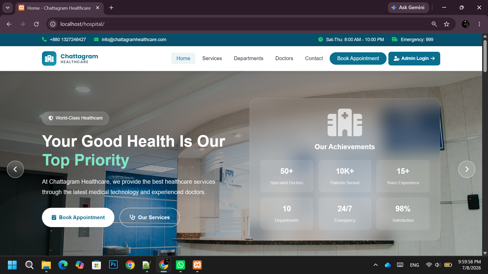
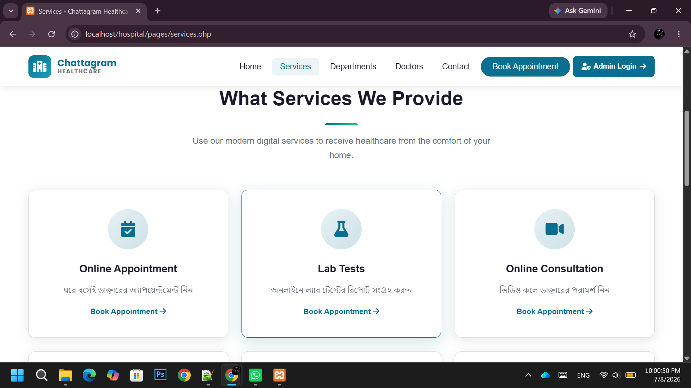
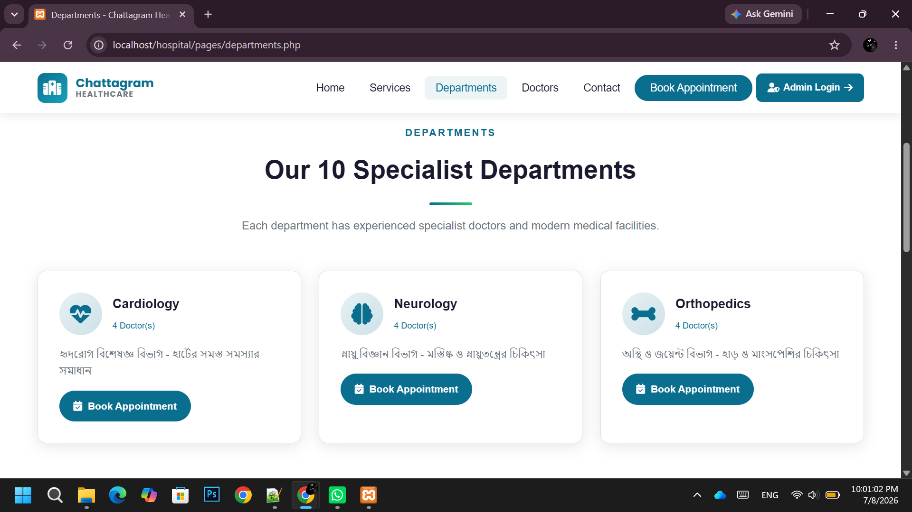
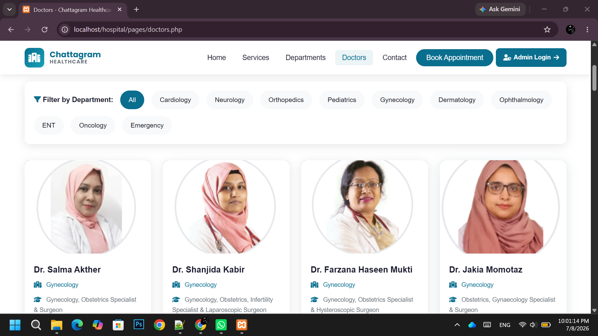
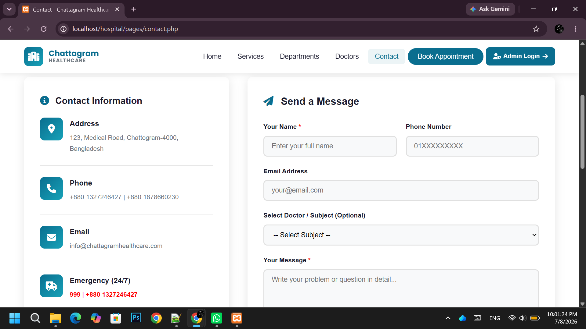
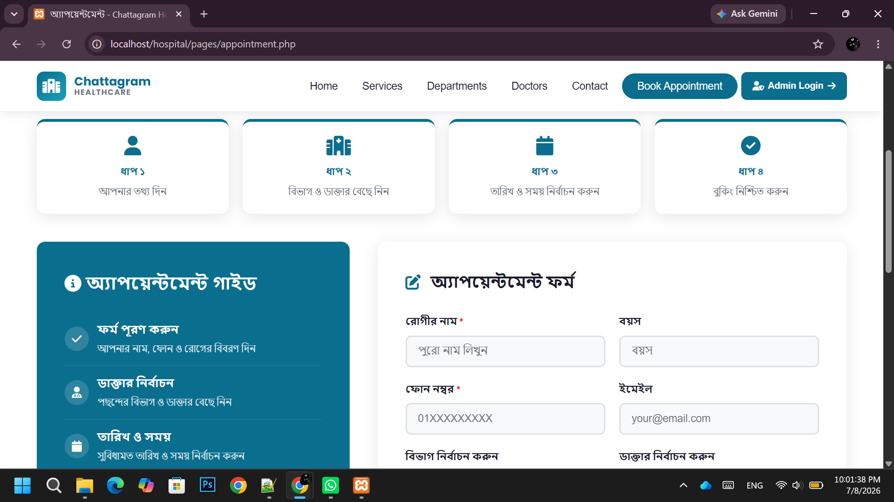
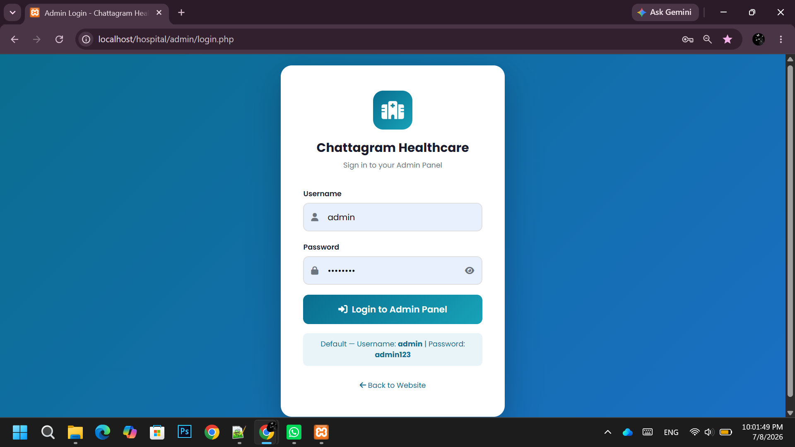
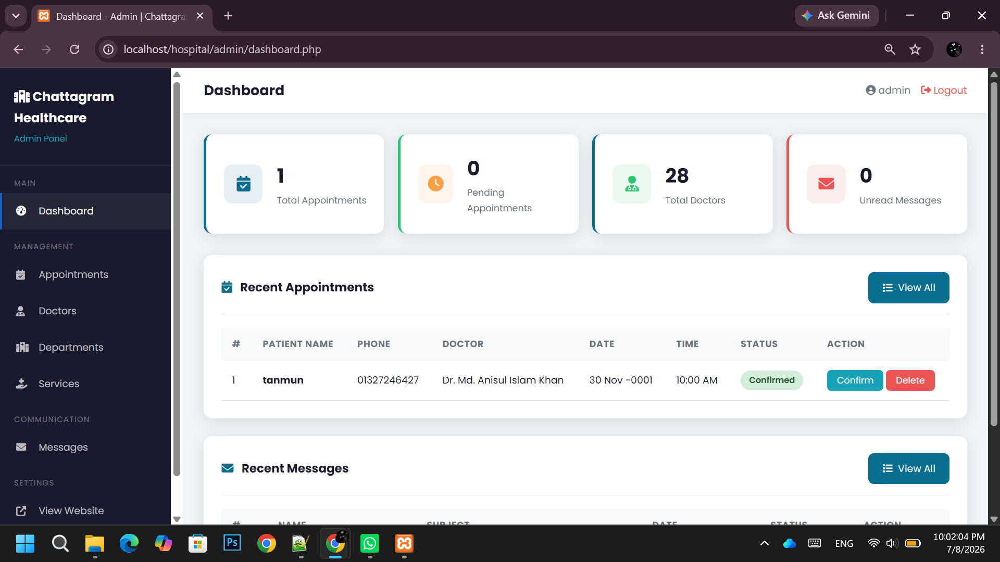

# Chattogram Healthcare - Dynamic Healthcare Management System

## PHP + MySQL + Bootstrap + XAMPP
## Project Overview

Chattogram Healthcare is a full-stack dynamic healthcare management system developed to manage doctors, appointments, healthcare services, and users efficiently.

## Technologies Used

- HTML
- CSS
- Bootstrap
- JavaScript
- PHP
- MySQL
- XAMPP

## Key Features

- User Registration & Login
- Doctor Management System
- Appointment Booking System
- Admin Dashboard
- Manage Doctors, Services & Departments
- Contact Message Management
- Responsive Design
---

## ইনস্টলেশন গাইড (ধাপে ধাপে)

### ধাপ ১: XAMPP চালু করুন
- XAMPP Control Panel খুলুন
- **Apache** ও **MySQL** Start করুন

### ধাপ ২: ফাইল কপি করুন
- `hospital` ফোল্ডারটি এই পথে রাখুন:
  ```
  C:\xampp\htdocs\hospital
  ```

### ধাপ ৩: Database তৈরি করুন
1. ব্রাউজারে যান: http://localhost/phpmyadmin
2. বাম দিকে "New" ক্লিক করুন
3. Database নাম দিন: `hospital_db` → Create
4. "Import" ট্যাবে যান
5. `hospital.sql` ফাইলটি সিলেক্ট করুন → Go

### ধাপ ৪: ওয়েবসাইট চালু করুন
- **মূল সাইট:** http://localhost/hospital
- **Admin Panel:** http://localhost/hospital/admin/login.php

### Admin Login তথ্য:
- **Username:** admin
- **Password:** admin123

---

## ওয়েবসাইটের পেজসমূহ

| পেজ | URL |
|-----|-----|
| হোম পেজ | http://localhost/hospital |
| সেবাসমূহ | http://localhost/hospital/pages/services.php |
| বিভাগসমূহ | http://localhost/hospital/pages/departments.php |
| ডাক্তারগণ | http://localhost/hospital/pages/doctors.php |
| যোগাযোগ | http://localhost/hospital/pages/contact.php |
| অ্যাপয়েন্টমেন্ট | http://localhost/hospital/pages/appointment.php |
| Admin Dashboard | http://localhost/hospital/admin/dashboard.php |

---

## Admin Panel-এ যা করা যাবে

✅ **Appointments** - সকল অ্যাপয়েন্টমেন্ট দেখা, নিশ্চিত করা, বাতিল করা, মুছে ফেলা  
✅ **Doctors** - ডাক্তার যোগ করা, এডিট করা, মুছে ফেলা, ছবি আপলোড  
✅ **Departments** - বিভাগ যোগ/এডিট/মুছুন  
✅ **Services** - সেবা যোগ/এডিট/মুছুন  
✅ **Messages** - যোগাযোগ বার্তা দেখা ও মুছে ফেলা  

---

## ফোল্ডার স্ট্রাকচার

```
hospital/
├── index.php              (হোম পেজ)
├── hospital.sql           (Database)
├── README.md
├── includes/
│   ├── config.php         (Database সংযোগ)
│   ├── header.php
│   └── footer.php
├── pages/
│   ├── services.php
│   ├── departments.php
│   ├── doctors.php
│   ├── contact.php
│   └── appointment.php
├── admin/
│   ├── login.php
│   ├── dashboard.php
│   ├── appointments.php
│   ├── doctors.php
│   ├── departments.php
│   ├── services.php
│   ├── contacts.php
│   ├── logout.php
│   └── includes/
│       ├── admin_header.php
│       └── admin_footer.php
└── assets/
    ├── css/style.css
    ├── js/main.js
    └── images/            (ডাক্তারের ছবি এখানে)
```
## Screenshots

### Home Page


### Doctor List Page


### Doctor Details Page


### Appointment Page


### Services Page


### Contact Page


### Login Page


### Admin Dashboard

